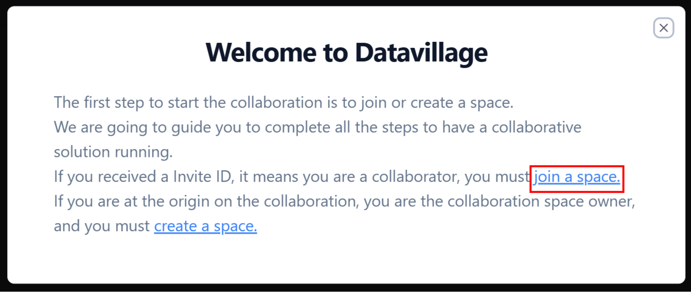
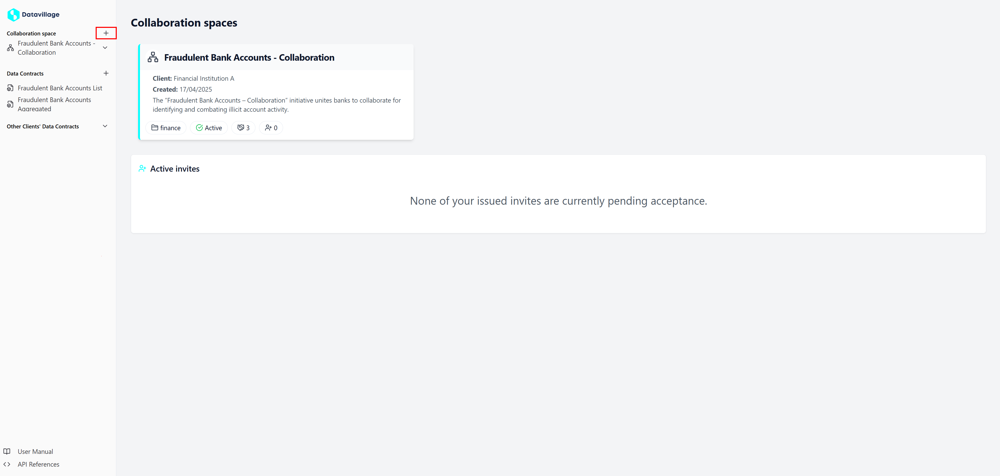
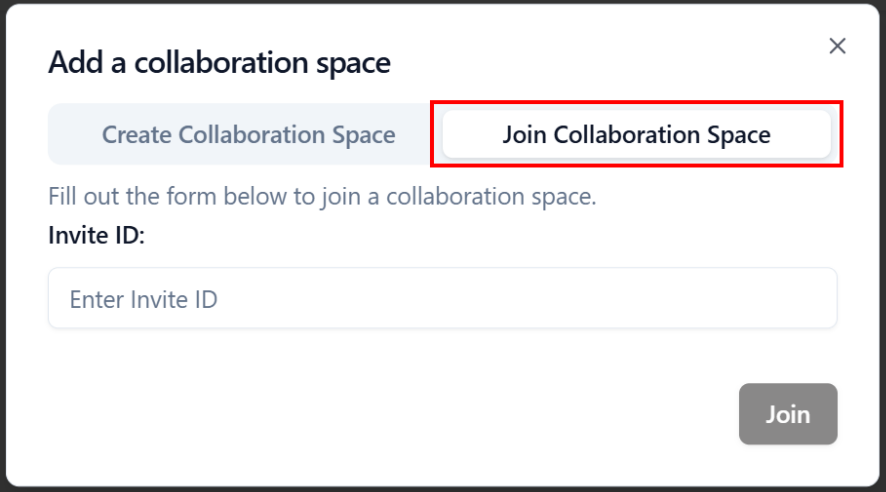
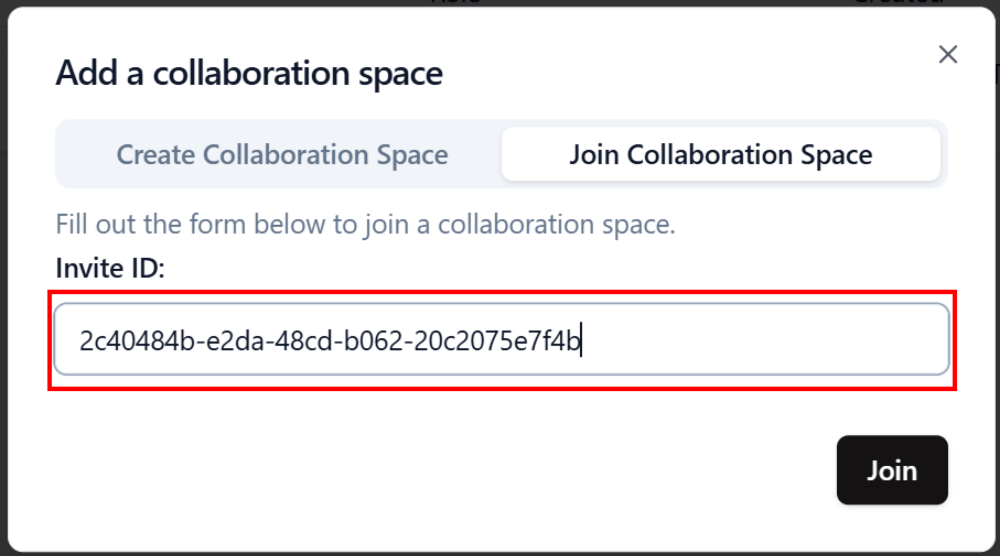
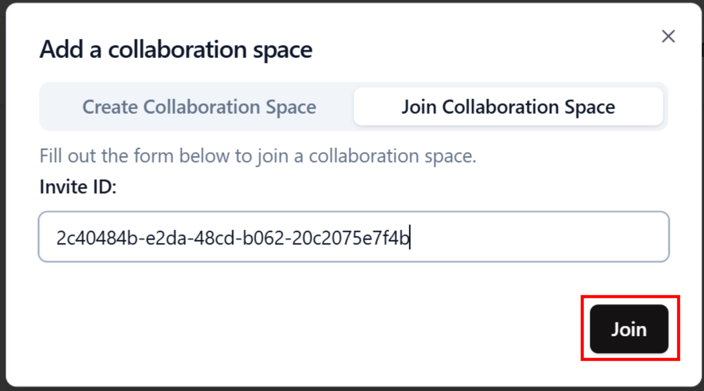
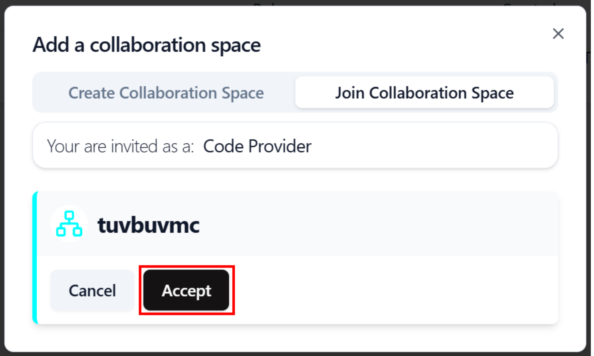

# Accept invite

To join a Collaboration Space, simply follow these steps:

1. You haven't created or join a space yet. Click on **join a space** in the welcome message
   

2. If you already collaborate in a space, click on the **+** button on the right of **Collaboration spaces** in the menu.  
   

3. Click on **Join Collaboration Space**
   

4. Enter the **Invite ID** provided by the Collaboration Space Owner.
   

5. Click on **Join** to see the **Invite** details.
   

6. Click on **Accept** to join the Collaboration Space.  
   

That's it! Once you submit your Invite ID, you'll be granted access to the Collaboration Space.  
You must now [configure algorithm provider](/docs/user-manual/code-provider/configure-collaborator/general).

For any issues or further assistance, please contact our support team.
