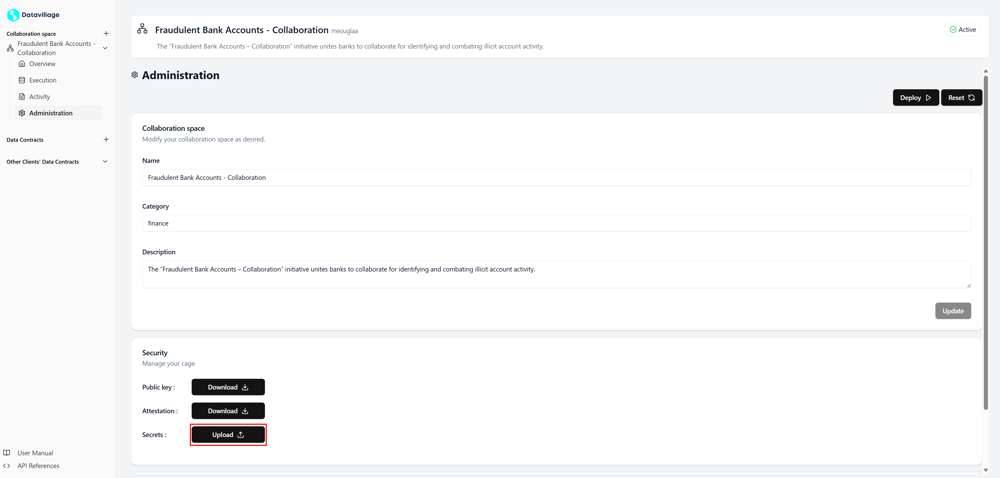
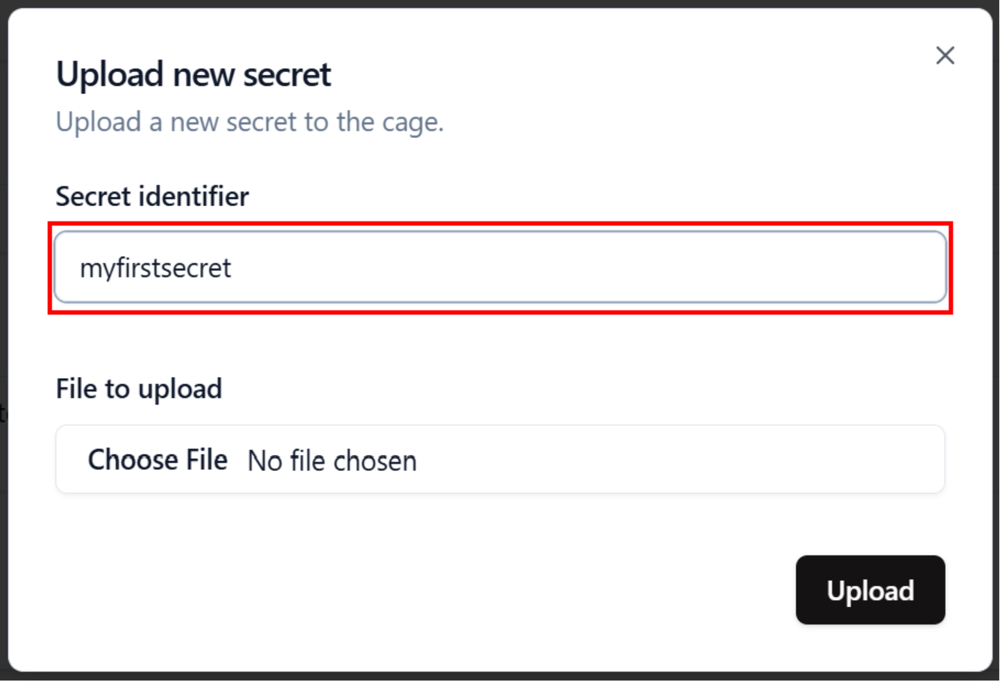
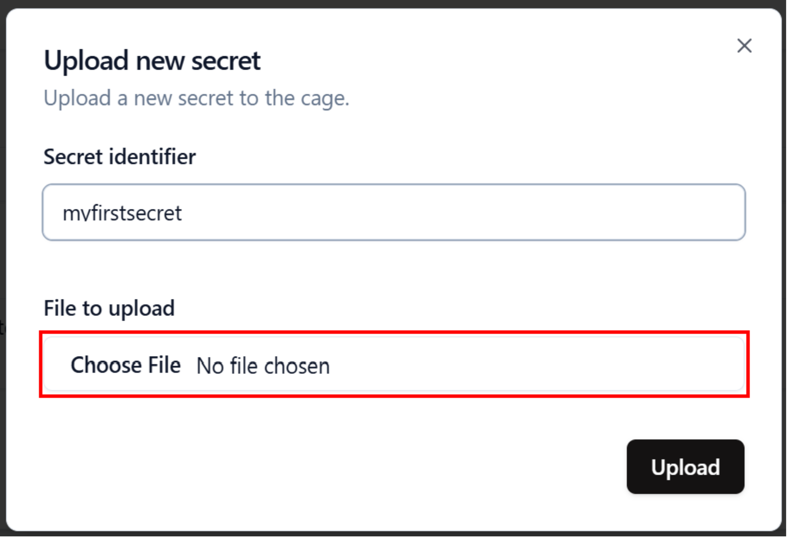
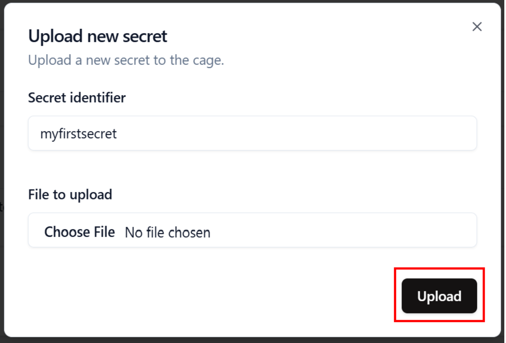

# Configure secrets

There are two ways to use configuration variables in an **algorithm** - In the **collaborator** with the **properties**.

- In a **secret** file which is encrypted with the public key of the cage and stored in the secret manager.

Secrets are key in a Collaboration Space, they can be used in the Algorithm to process the data, and are fully stored securely in the secret manager.

**Secrets** are created via uploading a **JSON** file.

1. If the **space** is **inactive**, [deploy space](/docs/user-manual/collaboration-space-owner/cage-management/deploy-cage)

2. Open the **Administration** page of your space.

   

3. Click on the **Upload** in the **Security** section of the page.

   

4. Enter a **Secret identifier**, it will be used in the **algorithm** to get the secret values.

   

5. Click on **Choose File**, and select your **JSON** file containing your secrets values.

   

6. Click on **Upload**.

   

7. Your **secret** are now saved in the secret manager.
