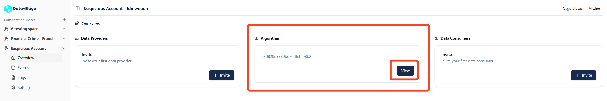
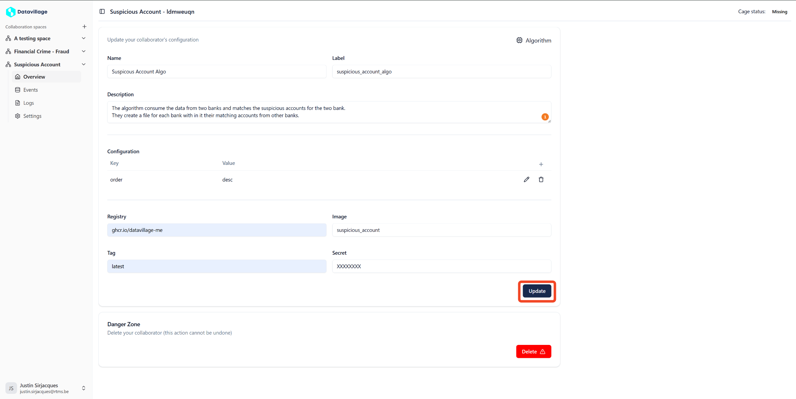

# General Configuration

To configure the **Algorithm** collaborator, open your space dashboard.  
Here you can see three columns the first one is the **Data Providers**, the second one is the **Algorithm**, and the last one is the **Data consumers**.  

1. **Open Algorithm Provider**  

Click on the **View** button on the Algorithm case.  
If you don't see the **View** button, it means you haven't invited yet the code provider to do so, refer to [Invite Collaborator](/docs/user-manual/collaboration-space-owner/invite-collaborator/create-invite.md).  

  
2. **Fill the properties** 

Fill all the fields and click on update.
<!-- **Name**  
The name of the collaborator that will the be displayed in the space dashboard.    

**Label**  
The technical label of the collaborator that will be used in datavillage, for example for the pod name.  
Can only contains alphabetic character and underscore.  

**Description**  
The description is used to understand what the algorithm does.   -->

Highlight on the **Configuration (Environment Variable)**:  
In the configuration sections you can set env variables that will be used in the algorithm.  

<!-- **Registry**  
The docker image registry url your when you are storing your algorithm image.  

**Image**  
The name of your algorithm image in your registry.  

**Tag**  
The tag of the image you want to deploy in the collaboration space.  

**Secret**  
The token to access your registry if your image isn't public.   -->

## Example

Four our real-world use-case configure the collaborator as in the below screenshot.  
Replace the **registry** with your registry url.  
The env variable in the configuration is used to set the order type of the accounts in the output file. 

By correctly configuring these settings, your collaboration space will be able to securely fetch and deploy your Docker image.
