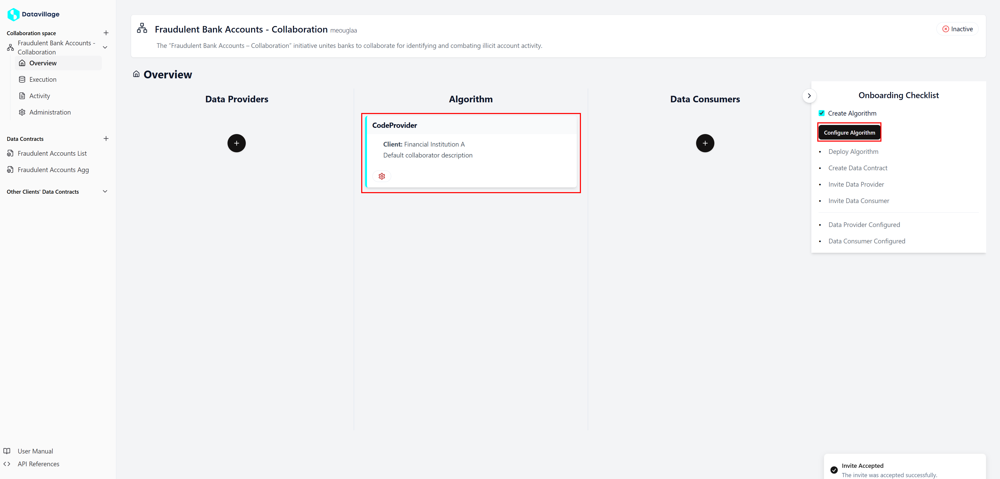

# Configure Algorithm

To configure the **Algorithm** collaborator, open your space **Overview**.  
Here you can see three columns the first one is the **Data Providers**, the second one is the **Algorithm**, and the last one is the **Data consumers**.  

1. **Open Algorithm Provider**  

    - Click on the **Algorithm** card or **Configure Algorithm** in the checklist.   

    

    - If you don't see the **Algorithm** card , it means you haven't created yet the **Algorithm Provider**, refer to [Create Algorithm Provider](/docs/user-manual/code-provider/create-invite)  

2. **Use the auto-fill for the properties**   

    - If the **Algorithm** is empty, the platform propose you to fill the properties with default values to be able to deploy the space.  
    - Click on **Yes** to configure the **Algorithm**.   

    .   

2. **Save the Algorithm**   

    - The **Algorithm** is now configured, click on **Update** to save it.

    .   

    - You can now deploy you **Collaboration Space** [Deploy Space](/docs/user-manual/collaboration-space-owner/cage-management/deploy-cage)  

3. **Configure with your properties** 

    - If you have already deployed the space, you can configure the **Algorithm** to deploy your docker image. 
    - In the **General Properties** set a name, a label and a description.
        - The **label** is used to retrieve the collaborator in the code.       
    - In the **Configuration** you can add variables that can be used in the code.  
    - In the **Registry** configure the access to your registry and image.  

    .   

## Example

- Four our real-world use-case:
    - In a first phase, deploy the space with the default properties.
    - When the space is **deployed** and the the **data providers** and **data consumers** are configured.
        - Configure the **Algorithm** to fetch your registry and image.   

By correctly configuring these settings, your collaboration space will be able to securely fetch and deploy your Docker image.
