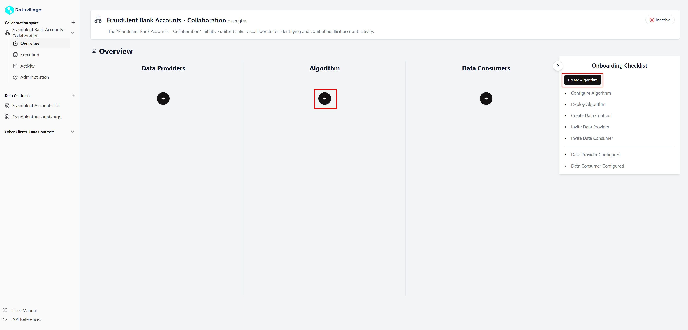
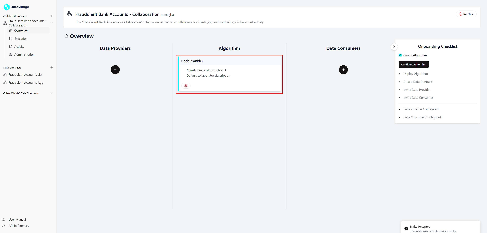

# Create algorithm

To create a **algorithm provider**, follow these steps:

1. Click on the **+** button under **Algorithm** or click on **Create Algorithm** in the check list in the space **Overview**.

2. Click on **Join As**

That's it! You have created the **algorithm provider**

For any issues or further assistance, please contact our support team.
