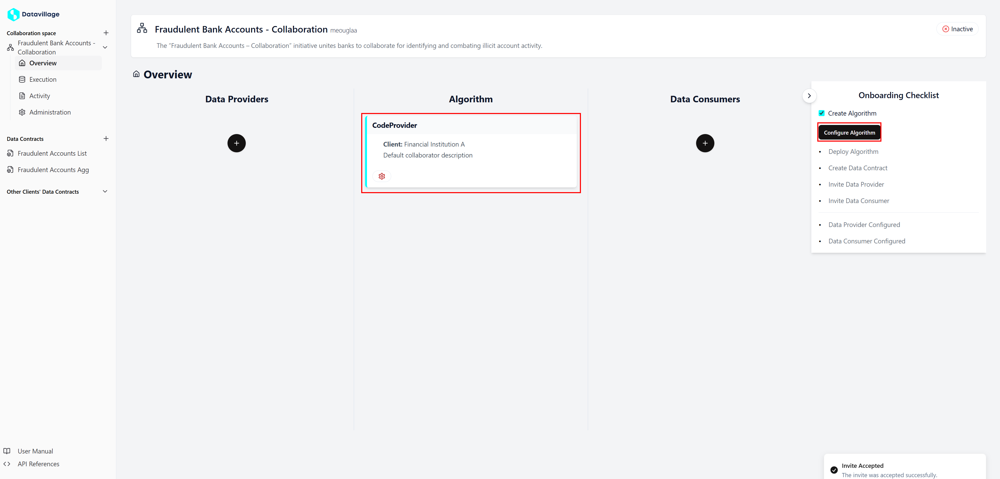
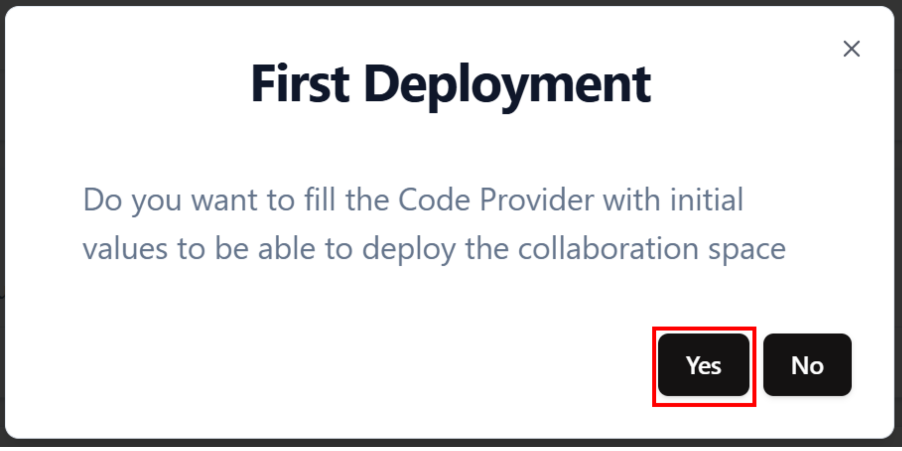
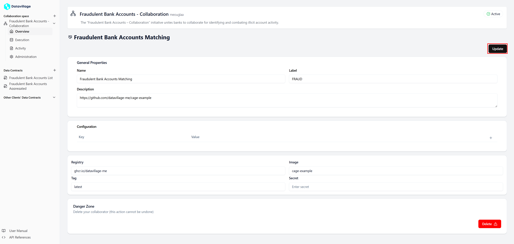
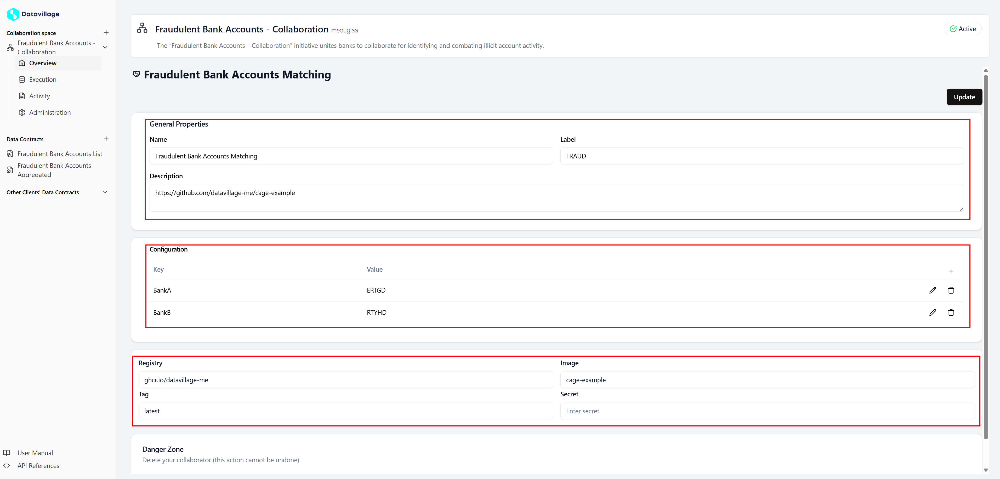

# Configure

To configure the **algorithm** collaborator, open your space **Overview**.  
Here you can see three columns the first one is the **Data Provider**, the second one is the **Algorithm**, and the last one is the **Data Consumer**.

1. **Open algorithm provider**

   - Click on the **Algorithm** card or **Configure Algorithm** in the checklist.

   

   - If you don't see the **algorithm** card , it means you haven't created yet the **algorithm provider**, refer to [create algorithm](/docs/user-manual/collaboration-space-owner/invite-collaborator/create-invite)

2. **Use the auto-fill for the properties**

   - If the **algorithm** is empty, the platform propose you to fill the properties with default values to be able to deploy the space.
   - Click on **Yes** to configure the **algorithm**.

   .

3. **Save the algorithm**

   - The **algorithm** is now configured, click on **Update** to save it.

   .

   - You can now deploy your **collaboration space** [deploy space](/docs/user-manual/collaboration-space-owner/deploy-space)

4. **Configure with your properties**

   - If you have already deployed the space, you can configure the **algorithm** to deploy your docker image.
   - In the **General Properties** set a name, a label and a description.
     - The **Label** is used to retrieve the collaborator in the code.
   - In the **Configuration** you can add variables that can be used in the code.
   - In the **Registry** configure the access to your registry and image.

   .

## Example

- Four our real-world use-case:
  - In a first phase, deploy the space with the default properties.
  - When the space is **deployed** and the the **data providers** and **data consumers** are configured.
    - Configure the **algorithm** to fetch your registry and image.

By correctly configuring these settings, your collaboration space will be able to securely fetch and deploy your Docker image.
