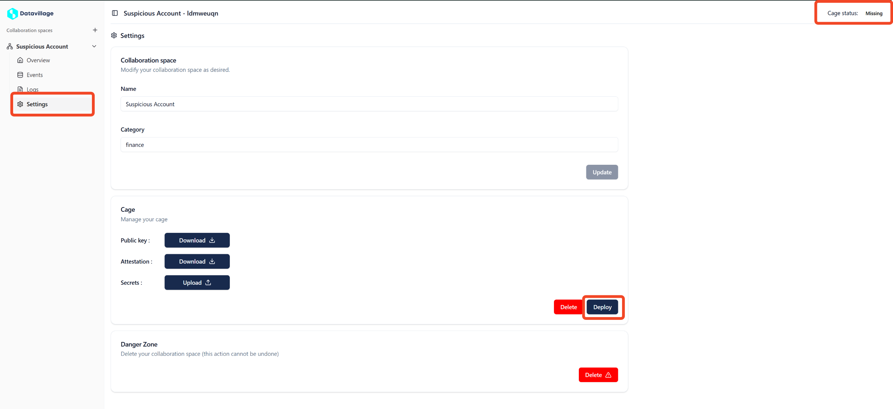
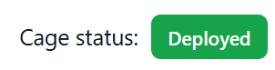

# Deploy Cage

A cage is a confidential computing environment containing the algorithm and datavillage utilities that make the collaboration space secured and easy to use.
 **If the cage isn't deployed, it is not possible to configure the secrets and collaborator's server/data source.**

## Deployment Process

When you trigger the first deployment, the system initiates the creation of the cage. During its lifecycle, the cage can be in one of several states, each indicating a different stage of the deployment process. When you deploy a cage that it is already deployed it will deploy the new version of the cage with zero down time. Which means that the previous cage will stop only when the new one will be running. 

## Status Explanations

- **Missing:**  
  This status indicates that the deployment is not found. It can occur if the deployment has not been initiated or has been removed. 

- **Pending:**  
  The pod is currently in the process of being scheduled and initialized. It is not yet fully operational. If the pod remains in this state for an extended period, check for configuration issues.

- **Deployed:**  
  The cage has been successfully deployed and is now running. This status confirms that your service is active and available, and that the deployment process completed without issues.

- **Error:**  
  An error has occurred during the deployment. This status means that the K8s pod failed to deploy properly, possibly due to misconfiguration, missing resources, or runtime errors. Review the logs and error messages to identify and resolve the problem.

## Deploy Cage

To deploy a cage you must open the space **Settings** page.  
On the top right of the page is displayed the status of the cage.  
Click on the **Deploy** button to deploy the cage, this might take few seconds 

The status must change to **Deployed**, you might need to refresh the page to get the new status of the cage. 

## Troubleshooting Tips

If you encounter an **Error** status:
- **Review Logs:** Check the deployment logs for detailed error messages.
  - [Logs](/docs/user-manual/collaboration-space-owner/cage-management/logs)
- **Verify Configuration:** Ensure that your docker image  is correctly configured and that can be run locally. 

