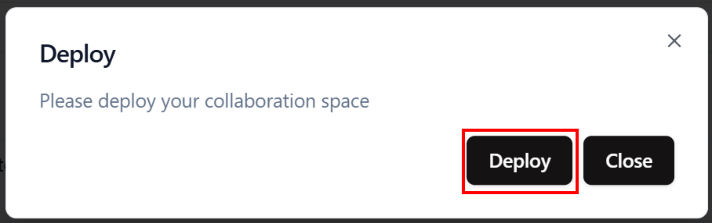
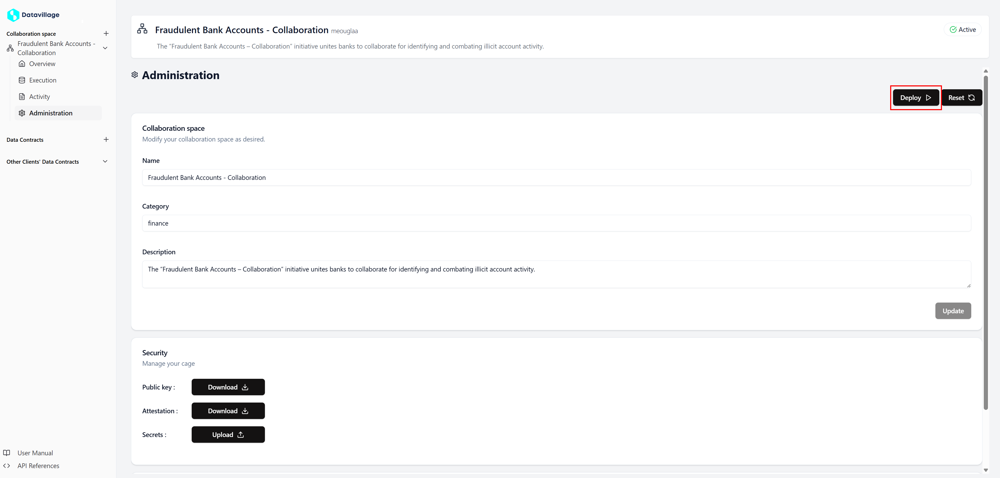

# Deploy Cage

A cage is a confidential computing environment containing the algorithm and datavillage utilities that make the collaboration space secured and easy to use.
 **If the cage isn't deployed, it is not possible to configure the secrets and collaborator's server/data source.**

## Deployment Process

When you trigger the first deployment, the system initiates the creation of the cage. During its lifecycle, the cage can be in one of several states, each indicating a different stage of the deployment process. When you deploy a cage that it is already deployed it will deploy the new version of the cage with zero down time. Which means that the previous cage will stop only when the new one will be running.

## Cage Status

- To deploy a cage you must open the space **Administration** page.
- Find the status of the cage on the top right of your screen.
- There are two status **Active** and **Inactive**

## Deploy Cage

- Open the **Administration** page
- If the space is **Inactive** a message will appear to ask you to **Deploy** the space.

- If the space is **Active**, you can deploy by clicking on the **Deploy** button.

## Troubleshooting Tips

If you encounter an **Inactive** status after a deployment:

- **Review Logs**  
  Check the deployment logs for detailed error messages.
  - [Logs](/docs/user-manual/collaboration-space-owner/cage-management/logs)
- **Verify Configuration**  
  Ensure that your docker image is correctly configured and that it can be run locally.
