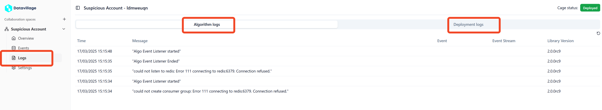

# Logs

In your collaboration space, logs are essential for monitoring and troubleshooting various aspects of your operations. 
All logs are accessible in the logs page of your collaboration space and are categorized into three types:

## Audit Logs

Audit logs record security and system events, such as user activities, configuration changes, and access attempts. They provide a detailed audit trail that helps track who did what and when within your space.

## Deployment Logs

Deployment logs capture the progress and status of your application deployments, including the creation and updates of Kubernetes pods. These logs indicate stages like pending, deployed, or error states, helping you diagnose deployment issues.

## Algo Logs

Algo logs document the execution details of your algorithms, including performance metrics, errors, and execution outcomes. They are key to monitoring algorithm behavior and ensuring that your data processing runs smoothly.

## Logs Page

---
