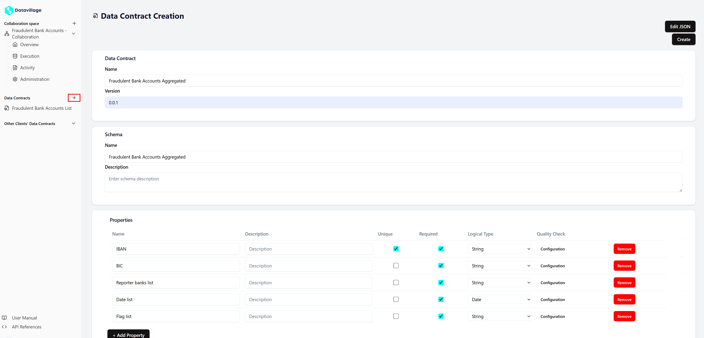
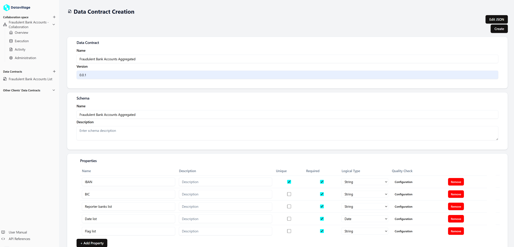

# Data contract

# Introduction

Data contracts are a fundamental concept in the Data Collaboration Platform (DCP). They define the schema of the data that an organization delivers or receives. By establishing a data contract, you ensure that the data's integrity is checked before any algorithm is executed, and the process can be halted if the data does not comply with the defined schema.

## Key concepts

- **ODCS:**  
  We follow the [Open Data Contract Standard (ODCS)](https://bitol-io.github.io/open-data-contract-standard/v3.0.0/). The DCP supports up to version 3.0.0, while maintaining backward compatibility down to v2.2.0.

- **Separate from collaboration spaces:**  
  Data contracts are defined independently from collaboration spaces. An organization can already define all its schemas before creating/joining a collaboration space.

- **Single data contract per server:**  
  A collaborator configures the server where the data should be pulled/pushed. Every such server should be described by exactly one data contract. The data pushed/pulled should comply with all properties defined in the schema. It is thus not possible to describe servers with different structures in one contract.

## Create data contract

Follow these steps to create a new data contract:

1. **Access the data contract creation page:**

- Navigate to the data contract section from the left main menu.  
  

2. **Define the schema in form mode:**

- The form mode is a simplified view of the data contract.
- This view enables you to quickly create a working contract.  
  

3. **Submit the data contract:**

- Click the **Create** button to submit your data contract.
  

## Real world use case

For our real world use case, we need to create two data contracts. One for the input and one for the output.

- **Scenario overview:**  
  Every day, **Bank A** and **Bank B** provide a file containing accounts with a fraudulent flag. **Bank B** receives the processed data for analysis.

- **Data contract role:**  
  The collaboration space owner creates a data contract that defines:

  - The schema for the incoming data from **Bank A** and **Bank B**.
  - The schema for the output data processed for **Bank B**.

  This data contract ensures that quality checks are applied and that only data conforming to the agreed schema is processed by the fraud detection algorithm.

- **Input data contract**
  

- **Output data contract**
  

- **Integration with invitations:**
  - In the next section it is shown how a collaborator can be assigned a data contract using invites.

---

This page provides an overview of data contracts within the DCP. A well-defined data contract is essential to maintain data quality and integrity throughout your collaboration space.
