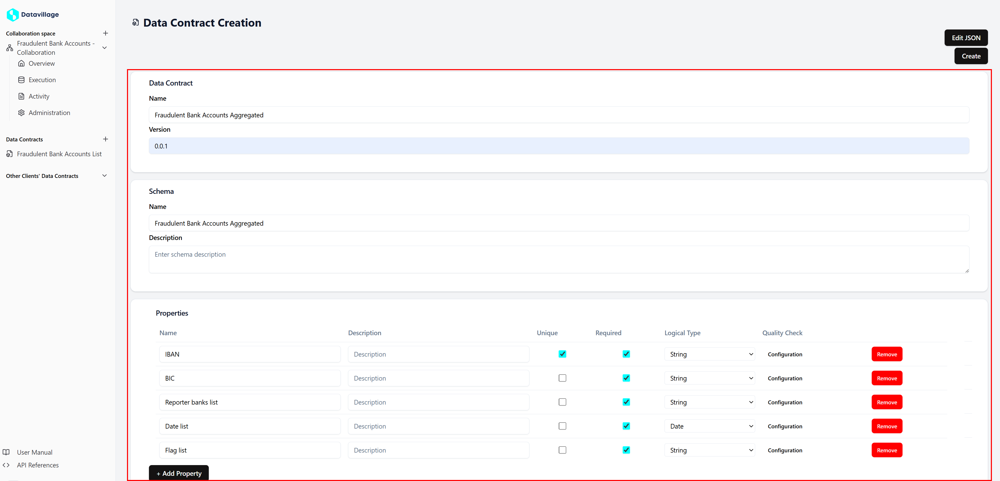
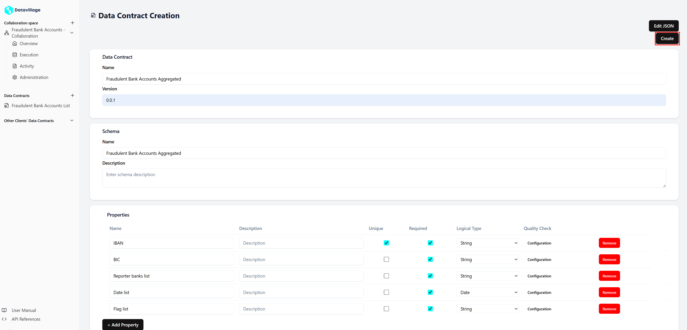

# Data Contract

# Data Contract

Data contracts are a fundamental concept in the Data Collaboration Platform (DCP). They define the schema of the data that an organization delivers or receives. By establishing a data contract, you ensure that the data's integrity is checked before any algorithm is executed, and the process can be halted if the data does not comply with the defined schema.

## Key Concepts

- **ODC Standard:**  
  We follow the ODC standard. The data model is defined using ODCS, with current implementation support up to version 3.0.0, while maintaining backward compatibility down to v2.2.0.

- **Separate from Collaboration Spaces:**  
  Data contracts are defined independently from collaboration spaces. An organization can already define all its schemas before creating/joining a collaboration space.

- **Single Schema per Data Contract:**  
  Each data contract is limited to one schema. This design allow to have for each data collaborator a data contract and a data source. The data provide/generated in the data source will have to be compliant with the data contract 

## Who can create a Data Contract   
- Any role can create a **Data Contract**, and their are all accessible from all clients.  
- Only the Collaboration Space Owner can attach a Data Contract to a Data Collaborator 
- For a secure collaboration
  - The data contract for the data provider must be defined by the data provider or the collaboration space owner.   
  - The Data Contract for the data consumer must be defined bu the collaboration space owner.  

## Role of the Data Contract

- Validates data quality by ensuring the provided and created data meets the required schema.

## Data Contract ID

When a Data Contract is created, DataVillage returns a unique ID. This ID must be included when sending invitations, ensuring that all collaborators are linked to the correct data contract.

## Create Data Contract

Follow these steps to create a new data contract:

1. **Access the Data Contract Creation Page:**  
  - Navigate to the data contract section from the left main menu.  
  

2. **Define the Schema in form mode:**  
  - The form mode is a simplify view of the Data Contract.   
  - This view able you to create quickly a working simple schema.  
  

3. **Submit the Data Contract:**  
  - Click the **Create** button to submit your data contract.
  

## Real World Use Case

For our real world use case, we need two create two data contract. One for the input and one for the output. 

- **Scenario Overview:**  
  **bank_a** and **bank_b** provides a daily file containing accounts with a fraudulent flag, and **bank_b** receives the processed data for analysis.

- **Data Contract Role:**  
  The collaboration space owner creates a data contract that defines:
  - The schema for the incoming data from **bank_a** and **bank_b**.
  - The  schema for the output data processed for **bank_b**.
  
  This data contract ensures that quality checks are applied and that only data conforming to the agreed schema is processed by the fraud detection algorithm.

- **Input Data Contract** 
  

- **Output Data Contract**
  

- **Integration with Invitations:**  
  - Once the data contract are created, you must select
    - **Fraudulent Bank Account List** in the **Data Provider** invites
    - **Fraudulent Bank Account Aggregated** in the **Data Consumer** invites

---

This page provides an overview of data contracts within the DCP. A well-defined data contract is essential to maintain data quality and integrity throughout your collaboration space.
