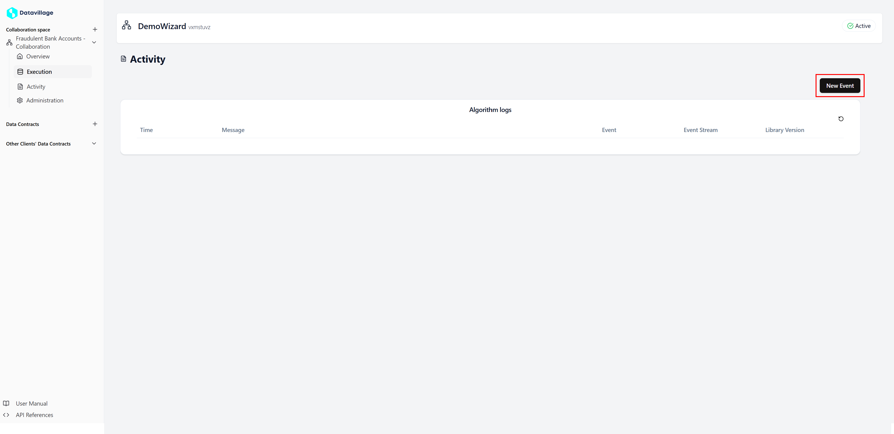

# Events

You can send events to your collaboration space.  
Those events will be received by the algorithm to trigger actions.  
Events are accessible in the **Activity** page of your collaboration space.

## Event structure

An event as two properties:

- **Type**: The event label, used in the algorithm to identify the action requested.
- **Payload**: The event data in JSON format.

## Send an event

1. Open the **Activity** section of your space.

   

2. Click on **New Event**.

   

3. Configure the **event**.

   

4. Click on **Publish**.

   
