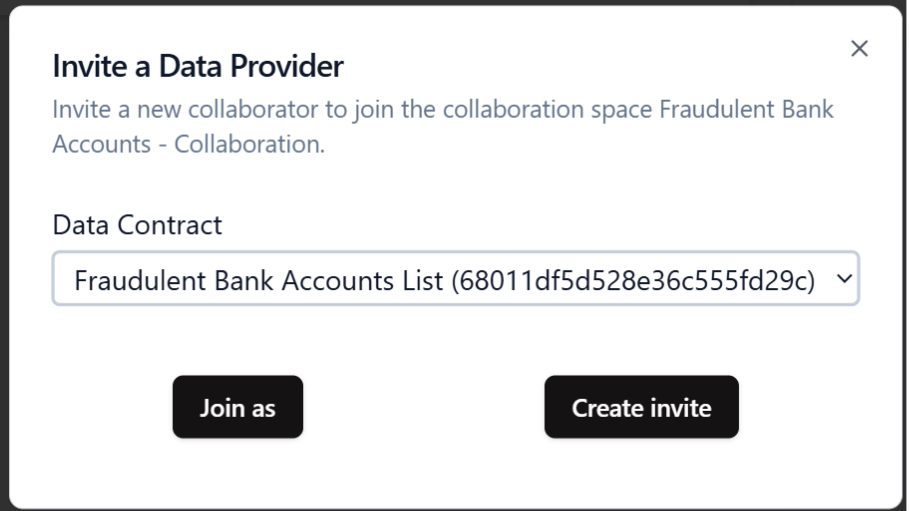

# Invite collaborator

**Invites** are the primary mechanism for onboarding new collaborators into your collaboration space. They serve as secure, unique access keys that grant specific permissions based on the type of collaborator you are inviting. There are three types of collaborators:

- **Data provider:**  
  An organization that supplies data. When creating an **invite** for a data Provider, you must select a **data contract** to ensure that the provided data adheres to a defined schema.

- **Data consumer:**  
  An organization that receives and uses data. **Invite** for data consumers also require a data contract, to ensure that the created data complies with the agreed-upon format.

- **Algorithm provider:**  
  An entity responsible for supplying or managing the code that supports the collaboration. Invites for algorithm provider do not require a data contract.

The **data contract** of the **invite** will be used to create the collaborator. The **data contract** in the collaborator is an immutable value.  
For Data Providers and Data Consumers: if an organization provides or consumes multiple data inputs/outputs, each input or output must be managed separately.  
For example, if Organization A has three distinct data inputs/outputs, you should create three individual **data contracts**, one for each input/output, and then create a separate **invite** for each corresponding **data source**.

By using invites, you maintain precise control over which organizations participate in each aspect of your collaboration space.

## Steps to create an invite

1. **Open the invite modal:**

   - In the space **Overview** panel, click on the **+** under a collaborator column.  
     

2. **Select a data contract (if applicable):**

   - For **data provider** and **data consumer**, select the corresponding Data Contract.
     

3. **Create the invite:**

   - Click on **Create Invite** button. An Invite ID will be generated upon successful creation.
     

4. **Distribute the invite ID:**
   - Share the generated **Invite ID** with the organization that will join your space.
     

## Example

### Overview

- **Bank A** and **Bank B** provide a daily file of accounts flagged as suspicious.
- **Bank B** consumes the results of the algorithm (insights) for processing.
- **Financial institution** provides the algorithm that turn the data into insights.

### Join as algorithm provider

- Click on the **+** button under **Algorithm** or directly in the onboarding checklist **Create Algorithm**.
- Click on **Join as** in the modal, the interface will create the Invite and make you join automatically.
- The **Code Provider** is now created and you are ready to [configure the algorithm](/docs/user-manual/code-provider/configure-collaborator/general) and [deploy the cage](/docs/user-manual/collaboration-space-owner/cage-management/deploy-cage).

### Join as data provider or consumer

- When the space is **deployed** and the **data contracts** are created, you can send the other **invites**.

To manage these distinct data flows, you must create separate Invites, each linked to a **data contract**:

- **Invite 1:** For **Bank A** as a **data provider** with data contract **Fraudulent Bank Account List**.
- **Invite 2:** For **Bank B** as a **data provider** with data contract **Fraudulent Bank Account List**.
- **Invite 3:** For **Bank B** as a **data consumer** with data contract **Fraudulent Bank Account Aggregated**.

Send the the **Invite IDs** to **BankA** and **Bank B**.  
They will join the space and configure their **collaborators**.

---

This guide outlines the purpose and proper use of invites, helping you effectively onboard collaborators with the appropriate permissions for your space.
