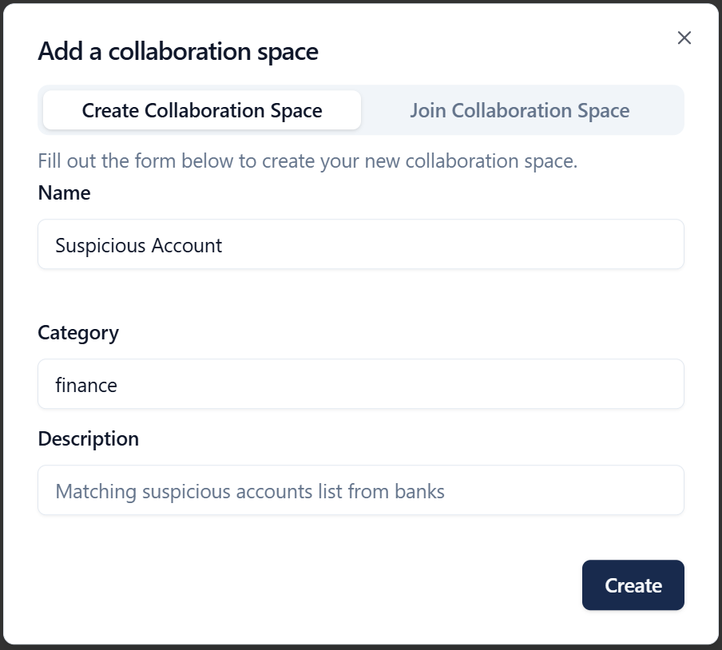
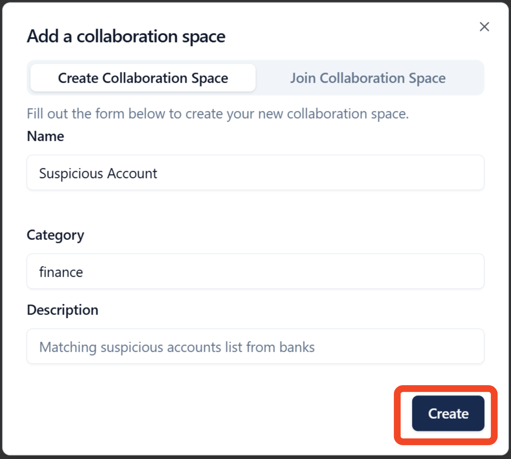
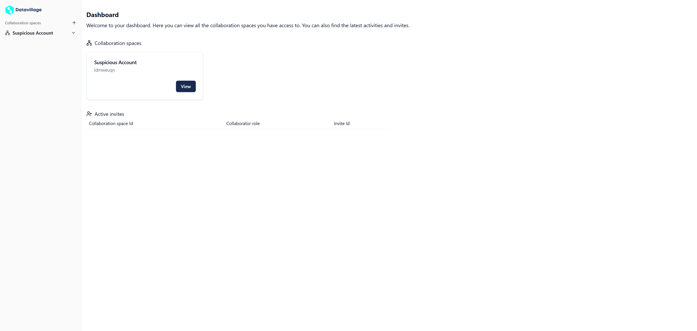

# Create Space

To begin your collaborative journey, you must first create a new space. A space is the dedicated collaboration space environment where you manage the collaborators and the data collaboration solution. 

## Space Properties

Every space must have a name, a category and a description.
- **Name:** Space name in one word
- **Category:** The business category of the collaboration space.
- **Description:** Short description of the purpose of the collaboration space

> **Tip:** Select a name that is simple, descriptive, and memorable.

## How to Create a Space

Follow these steps to create your space:

1. **Open Space creation**  
   Access the "Create Space" page from the main menu.

2. **Configure Space:**  
   Provide name, category and description

4. **Save space:**  
   Click the **Create** button to finalize the creation of your space.  
   Once your space is created, you'll be directed to the main dashboard.

4. **Datavillage  dashboard:**  
   Your space is now created. You can access it via the left menu or the by clicking on it in the main dashboard.

## Example

For our real-world use case, you must create a space with the below properties:
- **Create the fraud space:**  

- **Name:** Suspicious Account
- **Category:** Finance
- **Description:** Matching Suspicious Account list from Banks

Congratulations on creating your new collaboration space! The next step is to create the algorithm