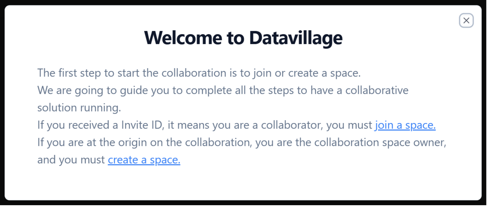
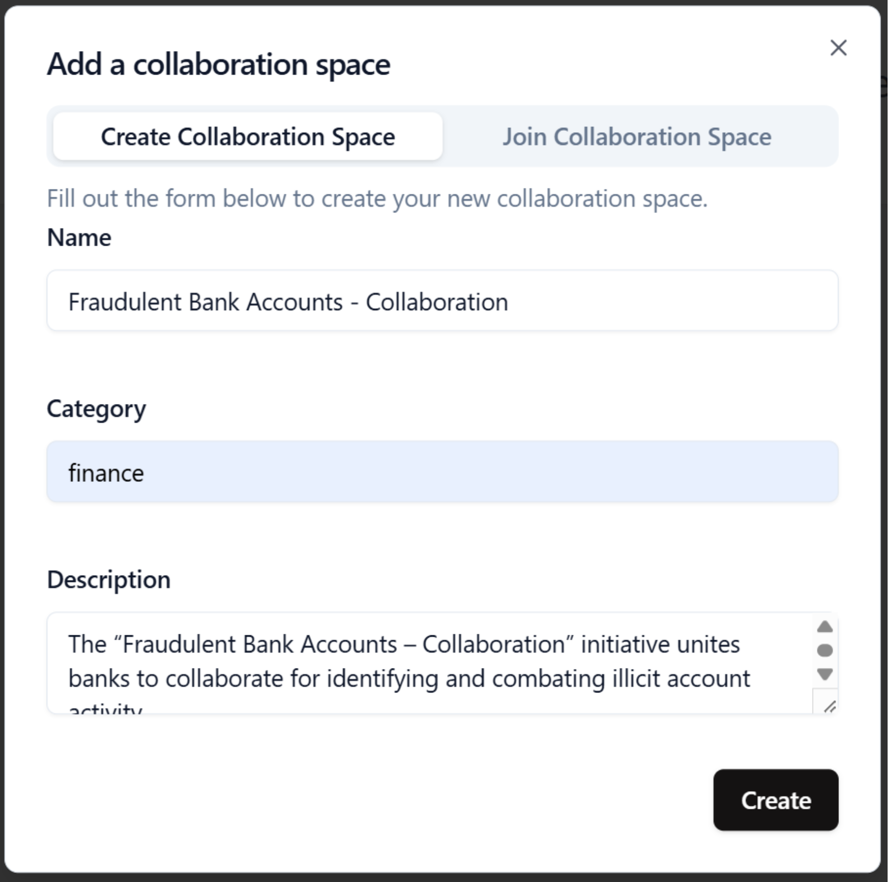

# Create space

To begin your collaborative journey, you must first create a new space. A space is the dedicated collaboration space environment where you manage the collaborators and the data collaboration solution.

## Space properties

Every space must have a name, a category and a description.

- **Name:** Space name in one word
- **Category:** The business category of the collaboration space.
- **Description:** Short description of the purpose of the collaboration space

> **Tip:** Select a name that is simple, descriptive, and memorable.

## How to create a space

Follow these steps to create your space:

1. **Open space creation**  
   Access the "Create Space" page from the main menu.

If you haven't join a space or created one yet, directly click on **create a space**.

If you already have joined or created a space, click on the **+ button**

2. **Configure space:**  
   Provide name, category and description

4. **Save space:**  
   Click the **Create** button to finalize the creation of your space.  
   Once your space is created, you'll be directed to the **Space Overview**.

5. **Datavillage dashboard:**  
   Your space is now created. You can access it via the left menu or by clicking it from the main dashboard.

## Example

For our real-world use case, the properties could be the following:

- **Name**  
  Fraudulent Bank Accounts - Collaboration
- **Category**  
  finance
- **Description**  
  The “Fraudulent Bank Accounts – Collaboration” initiative unites banks to collaborate for identifying and combating illicit account activity.

Congratulations on creating your new collaboration space! The next step is to create the algorithm
