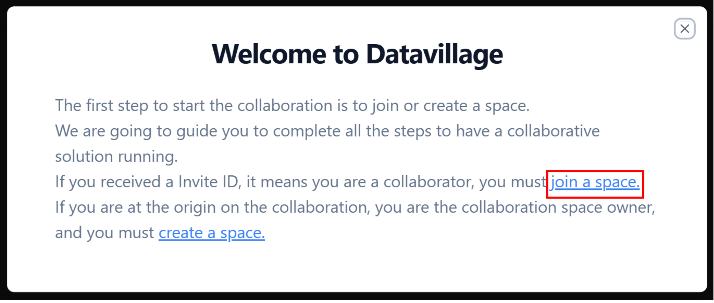
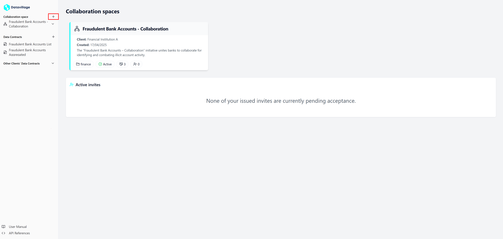
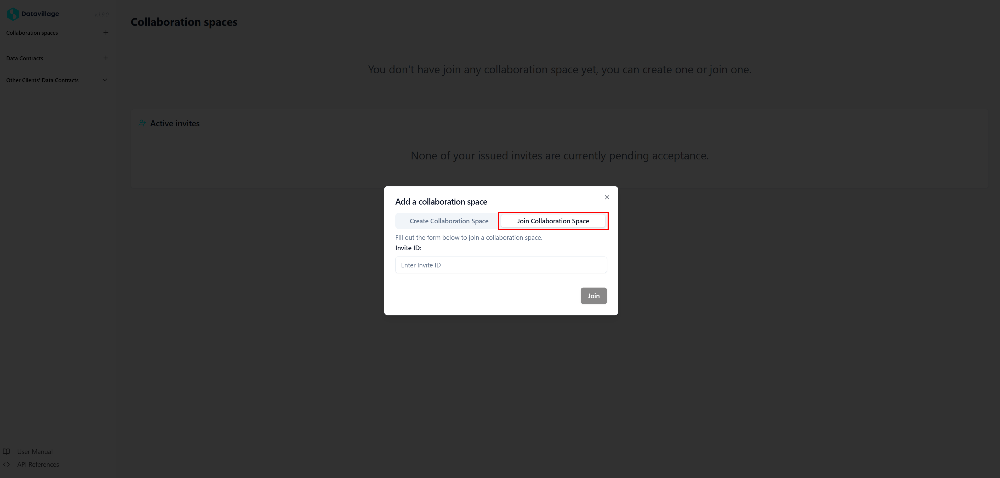
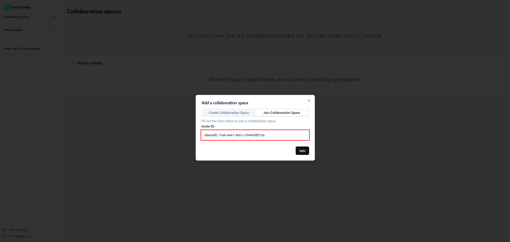
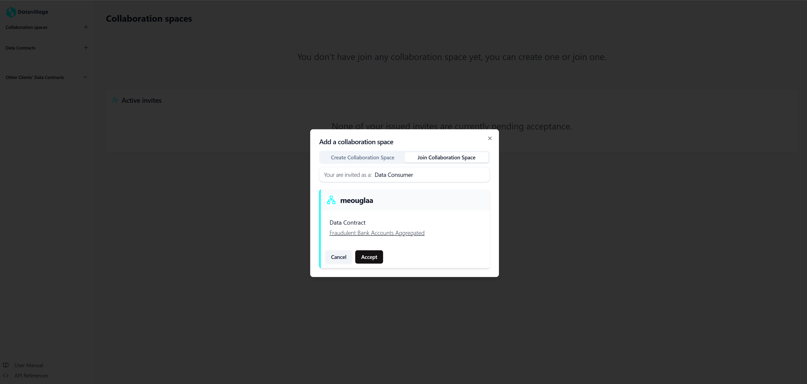
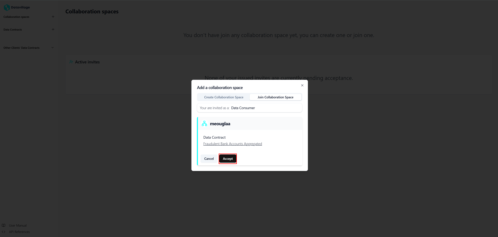

# Accept Invite

To join a Collaboration Space, simply follow these steps:

1. You haven't created or join a space yet. Click on **join a space** in the welcome message 

2. If you already collaborate in a space, click on the **+** button on the right of **Collaboration spaces** in the menu.   

3. Click on **Join Collaboration Space**

4. Enter the **Invite ID** provided by the Collaboration Space Owner.

5. Click on **Join** to see the **Invite** details.

5. Click on **Accept** to join the Collaboration Space.  

That's it! Once you accept the **Invite**, you'll be granted access to the Collaboration Space.  
You must now [Configure Data Consumer Collaborator](/docs/user-manual/data-consumer/configure-data-consumer)

For any issues or further assistance, please contact our support team.
