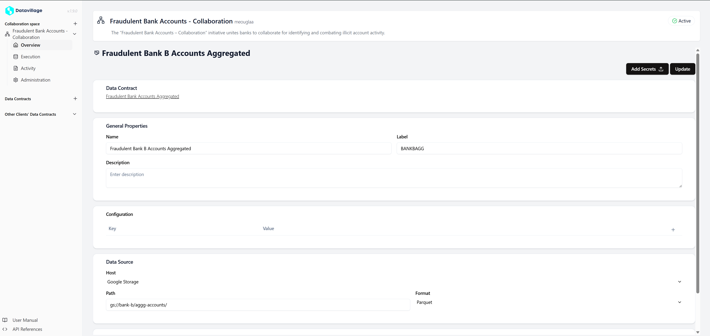
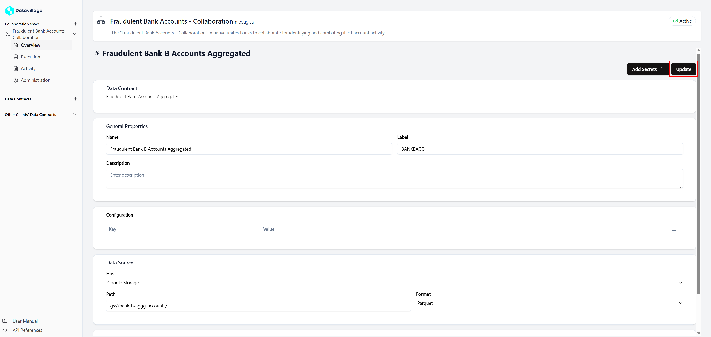

# Configure Data Consumer

To configure the **Data Consumer** collaborator, open your space **Overview**.  
Here you can see three columns the first one is the **Data Consumers**, the second one is the **Algorithm**, and the last one is the **Data consumers**.  

1. **Open Data Consumer**  

    - Click on your client **Data Consumer** card.    

    

2. **Configure with your properties** 

    - In the **Data Contract** section you can access the **Data Contract** attached to your **Data Consumer**. 
    - In the **General Properties** set a name, a label and a description.
        - The **label** is used to retrieve the collaborator in the code.       
    - In the **Configuration** you can add variables that can be used in the code.  
    - In the **Data Source** configure the access to your **s3** storage.  

    .   

3. **Click on Update**
    .   

By correctly configuring these settings, the **Collaboration Space** will be able to write correctly your data.  
