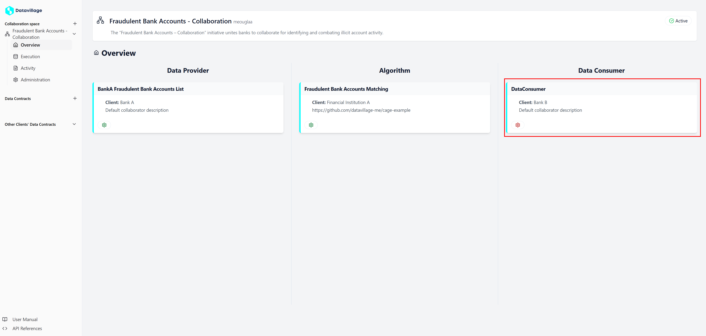

# Configure data consumer

To configure the **cata consumer** collaborator, navigate to the space **Overview** page.

1. **Open the data consumer**

   - Click on your client **Data Consumer** card.

   

2. **Configure with your properties**

   - In the **Data Contract** section you can access the **data contract** attached to your **data consumer**.
   - In the **General Properties** set a name, a label and a description.
     - The **Label** is used to retrieve the collaborator in the code.
   - In the **Configuration** you can add variables that can be used in the code.
   - In the **Data Source** configure the access to your **s3** storage.

   .

3. **Click on Update**
   .

By correctly configuring these settings, the **collaboration space** will be able to write your data securely.
