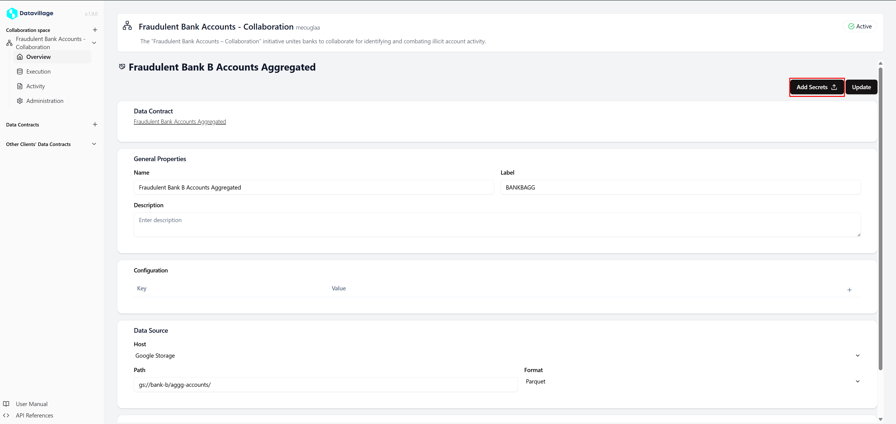
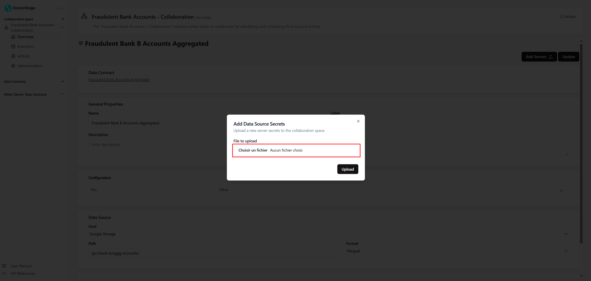
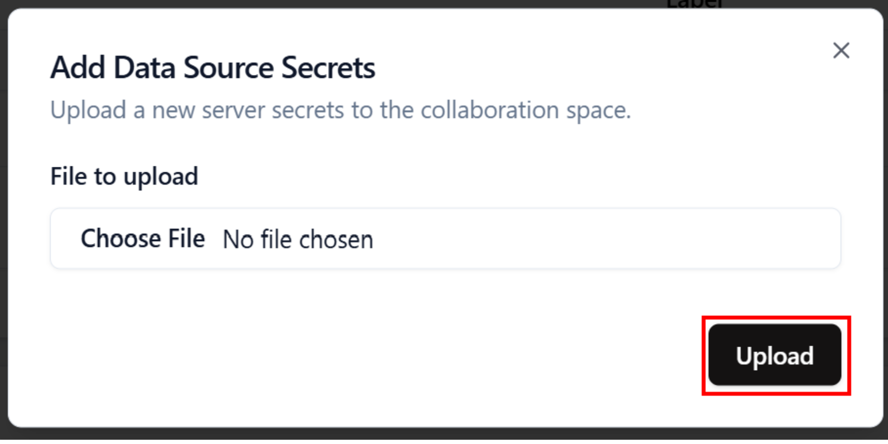

# Configure data source secrets

To write your data from the **collaboration space**, you must upload your **s3 credentials**.
It must be in a **JSON** file.
The needed values are:

- keyId
- secret
- encryptionKey (for Parquet)

```json
{
  "keyId": "XXXXXXXXXXXXXXXXXXXXXXXX",
  "secret": "XXXXXXXXXXXXXXXXXXXXXXXXXXXXXXXXXXXXXXXX",
  "encryptionKey": "09528bfd444ccbd1891ac54f627dab3b"
}
```

1. Open the **Data Consumer** page
   

2. Click on the **Add Secret**
   

3. Click on **Choose File**, and select your **JSON** file containing your data source credentials.
   

4. Click on **Upload**
   

5. Your secret is now saved in the secret manager.
