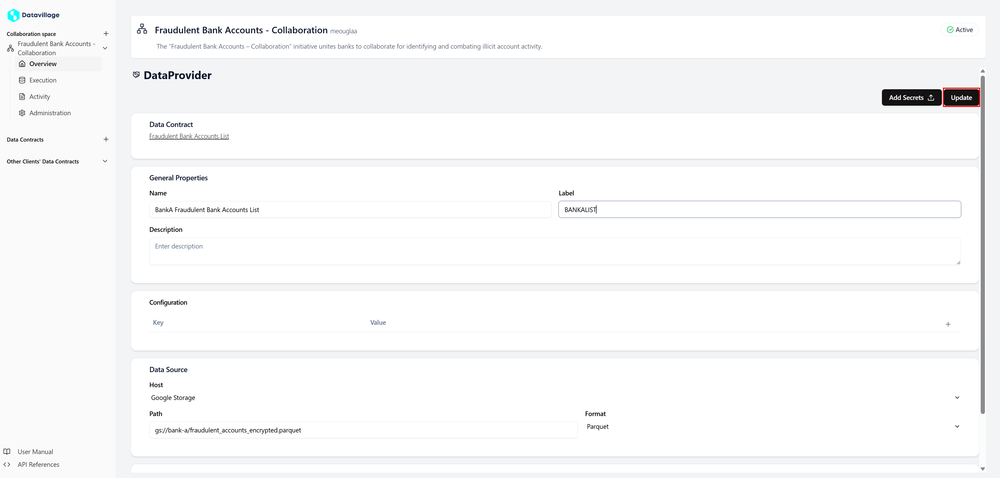

# Configure Data Provider

To configure the **Data Provider**, open your space **Overview** where you can see all collaborators in the space.

1. **Open Data Provider**

   - Click on your client **Data Provider** card.

   

2. **Configure with your properties**

   - In the **Data Contract** section you can access the data contract attached to your collaborator.
   - In the **General Properties** set a name, a label and a description.
     - The **label** is used to retrieve the collaborator in the code.
   - In the **Configuration** section, you can add environment variables that can be used in the code.
   - In the **Data Source** section, configure the access to your **S3** bucket.

   .

3. **Click on Update**
   .

By correctly configuring these settings, the cage will be able to fetch your data securely.
