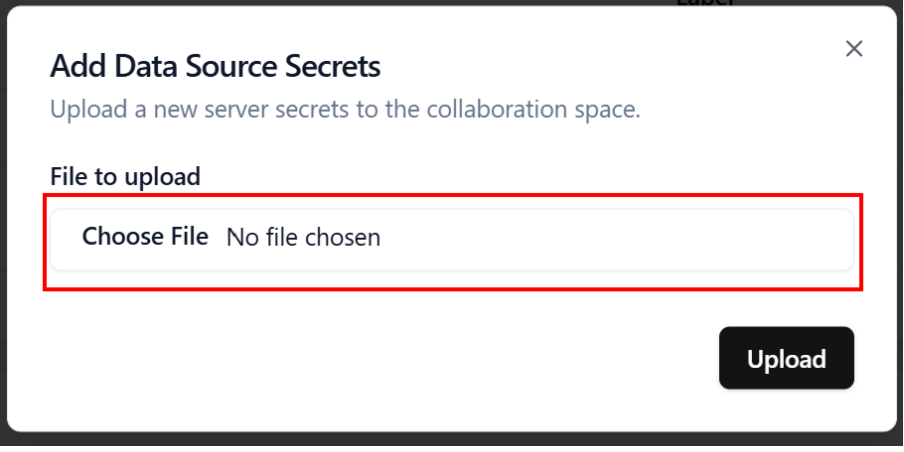

# Configure Data Source Secrets

To fetch your data from the cage, you must upload your **S3 credentials**. These credentials are HMAC keys configured through the Google Cloud Console. More information can be found in the [Creating Service Account](/docs/user-manual/data-provider/google-cloud-storage/create-service-account) section
It must be in a **JSON** file.
The needed values are:

- keyId
- secret
- encryptionKey (for Parquet files)

```json
{
  "keyId": "XXXXXXXXXXXXXXXXXXXXXXXX",
  "secret": "XXXXXXXXXXXXXXXXXXXXXXXXXXXXXXXXXXXXXXXX",
  "encryptionKey": "09528bfd444ccbd1891ac54f627dab3b"
}
```

1. Open the **Data Provider** page
   

2. Click on the **Add Secret**
   

3. Click on **Select a file**, and select your **JSON** file containing your data source credentials.
   

4. Click on **Upload** \
   This will encrypt the JSON file on the client side, using the public key of the cage, and upload it to the trusted environment.
   

5. Your secret is now saved in the trusted environment.
