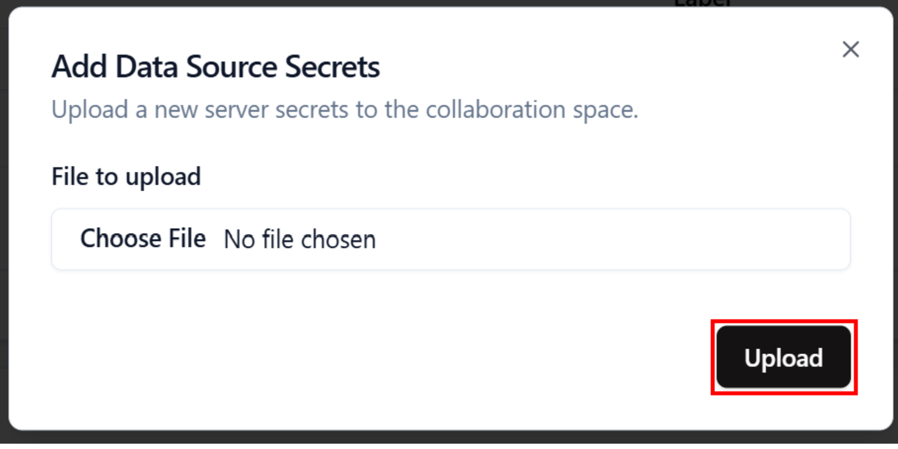

# Configure Data Source Secrets

To fetch your data from the **Collaboration Space**, you must upload your **s3 credentials**. 
It must be in a **JSON** file.
The needed values are:
- key_id 
- secret
- encryption_key

```json
{
    "key_id": "XXXXXXXXXXXXXXXXXXXXXXXX",
    "secret": "XXXXXXXXXXXXXXXXXXXXXXXXXXXXXXXXXXXXXXXX",
	"encryption_key": "09528bfd444ccbd1891ac54f627dab3b",
}
```

1. Open the **Data Provider** page


2. Click on the **Add Secret** 


3. Click on **Select a file**, and select your **JSON** file containing your data source credentials. 


6. Click on **Upload**


7. Your **Secret** are now saved in the secret manager.   

