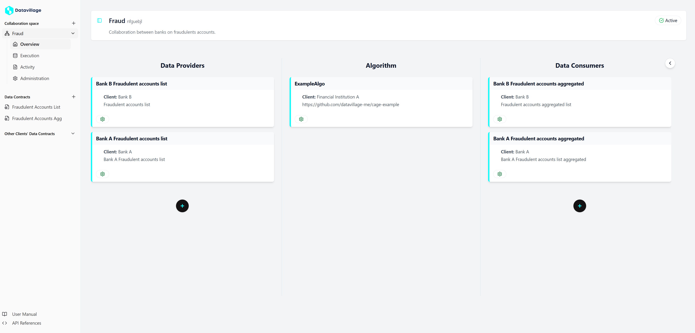

# Datavillage user manual

Welcome to the user manual of the Datavillage Collaboration Platform. This is composed to aid users of the platform to configure their collaboration spaces to unlock confidential data collaboration.

The user manual guides the user through the interface of the Datavillage Developer Console, a client side application that offers an intuitive UI to interact with the Datavillage Control Plane. If you wish to implement your own client side application, please consult the [Control Plane API](/docs/api/control-plane) to see the available endpoints.

Users can log in using any configured IDP. By default, a [Keycloak](https://www.keycloak.org/) instance is delivered to manage different IDPs. Every user is logged in as a member of a certain organisation, registered by the platform admin. For more details about authentication and authorization, consult the [documentation page](/docs/user-manual/auth).

We start off with explaining some important concepts on which the DCP is built. Then it is shown how to make and configure a collaboration space. After going through all the steps, you will have a collaboration space setup that looks as follows.

## Collaboration Spaces

The core concept around which the DCP is built, is a **collaboration space**. This is the unit of collaboration: every collaboration space has exactly one algorithm that processes data from one or more parties.

Every collaboration space is owned by exactly one organisation. Other organisations can join as a **collaborator**, this is explained in more depth in the next section. Ofcourse, the organisation that owns the space can also join as a collaborator if they wish to participate in the collaboration as well.

### Collaborators

There are 3 kinds of collaborators:

- **Data Provider**: the organisation provides data that serves as input to the algorithm. It defines a _data contract_ and a _data source_ that is used by the cage to pull the data
- **Data Consumer**: the organisation should have access to the output of the algorithm, also called the _insights_. The way these insights are commumicated can be conifigured analogous to the Data Provider
- **Algorithm Provider**: the organisation provides the algorithm that turns the data into insights. There can be only one algorithm provider (as opposed to data consumers and producers). It should create a docker image running the algorithm and provide the parameters to pull the image in the trusted environment

An organisation can take on multiple roles. The owner of the space is not required to take on any of these roles.

## Data Contracts and Data Sources

Another very important concept in the DCP, is a **data contract**. This defines the schema of the data an organisation delivers/recieves. Before execution of the algorithm, the integrity of the data can be checked and the algorithm can be stopped if the data does not comply with the schema that is defined in the data contract.

Data contracts are defined apart from collaboration spaces: an organisation could already define all their schemas before joining a single collaboration space.
The data model is defined using [ODCS](https://bitol-io.github.io/open-data-contract-standard/v3.0.0/), current implementation supports up to `v3.0.0`, which is backwards compatible until `v2.2.0`. The endpoints to perform CRUD operations can be found [here](/dv-documentation/docs/api/control-plane/data-contracts).

### Servers

To tie the concepts 'data contract' and 'collaboration space' together, there is the notion of **servers** (analagous to servers in [ODCS](https://bitol-io.github.io/open-data-contract-standard/v3.0.0/#infrastructure-and-servers)).
This is used to define where and how the algorithm should pull the data from, or push the insights to. It can be defined either for a data contract or specifically for a collaboration space.

The ODCS model for servers does not incorporate secrets. This is a good thing, as we don't want secrets leaking. To tell the cage which secrets it should use to pull/push data, we should configure a **connector**. This is a simple object containing the secrets. It is not stored in the database, but rather send encrypted directly to the cage from the client side application.

### Integrity check

Within the [Python SDK](https://pypi.org/project/dv-utils/) to develop algorithms for the Datavillage DCP, there is the possibility to perform _integrity checks_ before executing the algorithm. This will validate the pulled data to the configured data contract and throw an exception if it does not comply. The same goes for data that has to be pushed to a data consumer.
