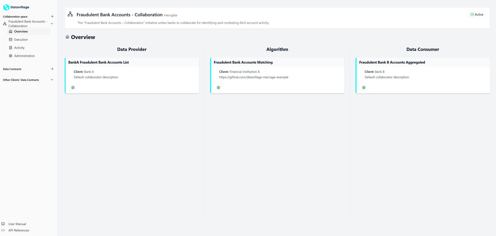

# Welcome to Datavillage

Welcome to the user manual of the Datavillage Collaboration Platform (DCP). This is composed to aid users of the platform to configure their collaboration spaces to unlock confidential data collaboration.

The user manual guides the user through the interface of the Datavillage Developer Console, a client side application that offers an intuitive UI to interact with the Datavillage Control Plane. If you wish to implement your own client side application, please consult the [Control Plane API](/docs/api/control-plane) to see the available endpoints.

Users can log in using any configured IDP. By default, a [Keycloak](https://www.keycloak.org/) instance is delivered to manage different IDPs. Every user is logged in as a member of a certain organization, registered by the platform admin. For more details about authentication and authorization, consult the [documentation page](/docs/user-manual/auth).

We start off with explaining some important concepts on which the DCP is built. Then it is shown how to make and configure a collaboration space. After going through all the steps, you will have a collaboration space setup that looks as follows.

## Collaboration spaces

The core concept around which the DCP is built, is a **collaboration space**. This is the unit of collaboration: every collaboration space has exactly one algorithm that processes data from one or more parties.

Every collaboration space is owned by exactly one organization. Other organizations can join as a **collaborator**, this is explained in more depth in the next section. Of course, the organization that owns the space can also join as a collaborator if they wish to participate in the collaboration as well.

### Collaborators

There are 3 kinds of collaborators:

- **Data provider**: the organization provides data that serves as input to the algorithm. It defines a _server configuration_ that is used by the cage to pull the data. It can be validated using a _data contract_.
- **Data consumer**: the organization consumes the output of the algorithm, also called the _insights_. The way these insights are communicated can be configured analogous to a Data Provider
- **Algorithm Provider**: the organization provides the algorithm that turns the data into insights. There can be only one algorithm provider (as opposed to data consumers and producers). It should create a docker image running the algorithm and provide the parameters to pull the image in the trusted environment

An organization can take on multiple roles. The owner of the space is not required to take on any of these roles.

## Data contracts and servers

Another very important concept in the DCP, is a **data contract**. This defines the schema of the data an organization delivers/receives. Before execution of the algorithm, the validity of the data can be checked and the algorithm can be stopped if the data does not comply with the schema that is defined in the data contract.

Data contracts are defined apart from collaboration spaces: an organization could already define all their schemas before joining a single collaboration space.
The data model is defined using [ODCS](https://bitol-io.github.io/open-data-contract-standard/v3.0.0/), current implementation supports up to `v3.0.0`, which is backwards compatible until `v2.2.0`. The endpoints to perform CRUD operations can be found [here](/dv-documentation/docs/api/control-plane/data-contracts).

**Servers** define how the data should be pulled or pushed. It is configured by the collaborator and also follows [ODCS](https://bitol-io.github.io/open-data-contract-standard/v3.0.0/) standard.

### Quality check

Quality checks can be run either from the algorithm in the cage, or through the Control Plane. The latter makes sure collaborators can test their data before the algorithm is executed. Running a quality check in the cage makes sure that the results are not outdated when running the algorithm.
